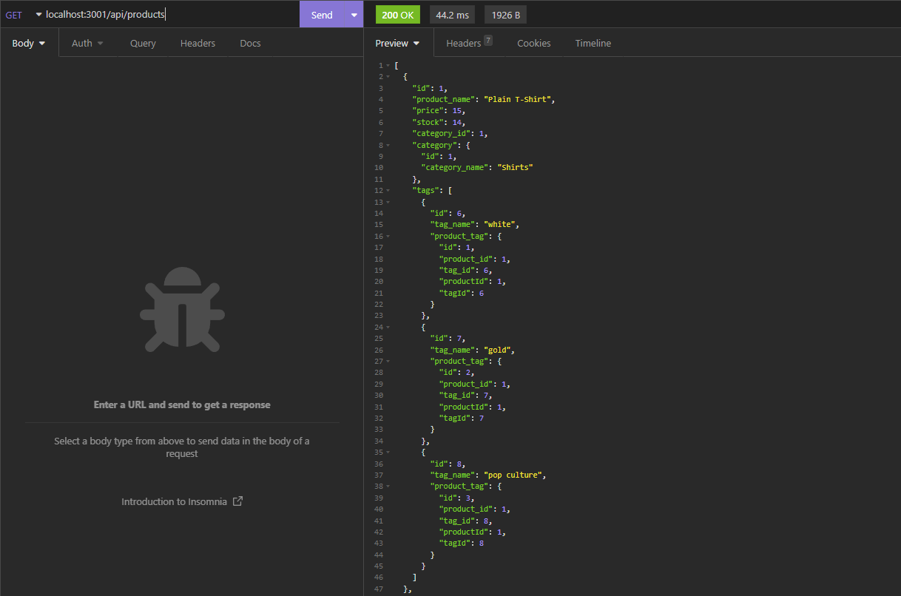

# E-Commerce Back End
  
  [](https://opensource.org/licenses/MIT)

  ## Description
  Application consists on an Express.js API that uses sequelize to interact with MySQL database.


  

  ## Demo Video available at:
  https://drive.google.com/file/d/1HnRbQdmKXL6U_mY0gF1Bn-mzdbbXBAZH/view

  ## Table of Contents
  - [Installation](#installation)
  - [Usage](#usage)
  - [Features](#features)
  - [License](#license)
  - [Contributing](#contributing)
  - [Tests](#tests)
  - [Questions](#questions)
  - [Credits](#credits)
  
  ## Installation
  Please install the following 
  ```` 
  npm i 
  ````
  The following packages will be installed:express, sequelize, mySQL2, and dotenv.

  ## Usage
  This application consists on a back-end for an e-commerce website, it enables the connection of the front-end e-commerce website to the back-end using Sequelize. Data can be created, retrieved, updated and deleted.
  
  ## Features
  1. Connects to a database using Sequelize 
  2. Creates a development database 
  3. When the application is invoked, the server is started and Sequelize models are synced to MySQL database 
  4. API GET routes display information on categories, products and tags 
  5. Data can be created with an API POST call 
  6. Data can be updated with an API PUT call 
  7. Data can be deleted with API DELETE route call in Insomnia

  ## License
  [](https://opensource.org/licenses/MIT)
  
  This application is covered by MIT license, available at:
  https://opensource.org/licenses/MIT

  ## Contributing
  Please feel free to send a pull request, the following is my GitHub account: https://github.com/Renatatims

  ## Tests
  Please make sure the inquirer is installed and all the following packages: 
  ```` 
  npm i express sequelize mySql2 dotenv 
  ```` 
  Once node_modules are downloaded, then the application can be invoked in the terminal 
  
  ````
  node server
  ````

  ## Questions
  If you have any questions please contact me at:
   - GitHub account:https://github.com/Renatatims
   - e-mail account: renatatims@gmail.com

  ## Credits
  https://www.npmjs.com/package/mysql2, 
  https://www.npmjs.com/package/sequelize, 
  https://www.npmjs.com/package/dotenv
 
